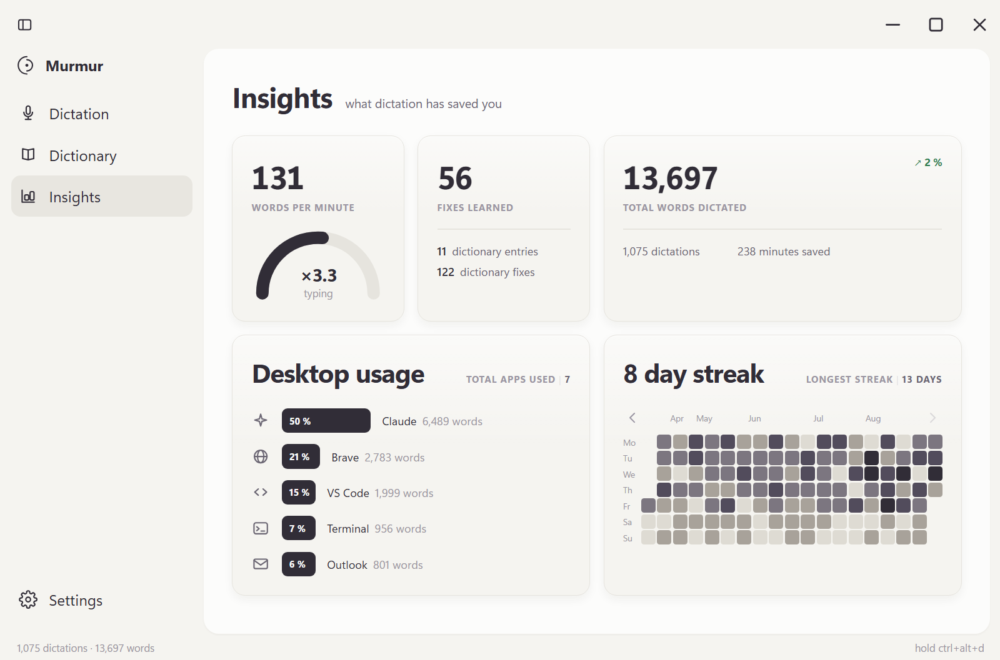

# Murmur

**Dicter à la voix dans n'importe quelle application Windows. Hors ligne.**

Vous maintenez `Ctrl+Alt+D`, vous parlez, vous relâchez. Le texte arrive dans la
fenêtre active en environ 380 ms. Aucun octet ne quitte la machine — ni
pendant, ni après.



---

## Pourquoi

Les outils de dictée qui marchent bien envoient votre voix sur les serveurs
d'une entreprise, exigent un abonnement, et cessent de fonctionner sans
connexion. Murmur fait le contraire : le modèle tourne sur votre carte
graphique, votre voix ne va nulle part, et il n'y a rien à payer.

Le prix à payer est ailleurs — dans le code. Faire tourner Whisper sur une
carte AMD sous Windows, insérer du texte dans une application quelconque,
dessiner une fenêtre sans barre de titre système : chacun de ces points a
demandé des mesures et plusieurs tentatives. Le journal de bord
([`docs/JOURNAL.md`](docs/JOURNAL.md)) les raconte, échecs
compris.

## Installation

1. Téléchargez l'archive depuis la page
   [Releases](../../releases/latest) — environ 56 Mo.
2. Décompressez-la où vous voulez. Aucune installation, aucun droit
   administrateur.
3. Lancez `Murmur.exe`.

Au premier démarrage, Murmur télécharge son modèle de reconnaissance vocale —
**une seule fois**, et il choisit celui qui convient à votre machine :

| votre machine | modèle | taille | latence mesurée |
|---|---|---|---|
| carte graphique compatible Vulkan | `large-v3-turbo` | 574 Mo | ~250 ms |
| processeur seul | `small` | 190 Mo | ~2 s |

Ensuite, plus rien n'entre ni ne sort.

> **Windows affichera « Windows a protégé votre ordinateur ».** C'est normal :
> l'exécutable n'est pas signé, et un certificat de signature coûte plusieurs
> centaines d'euros par an. Cliquez sur **Informations complémentaires** puis
> **Exécuter quand même**. Si vous préférez ne pas faire confiance à un binaire,
> le code est ici en entier et se reconstruit en une commande.

### Ce qu'il faut

- Windows 10 ou 11, 64 bits
- Une carte graphique compatible Vulkan — n'importe quel fabricant, AMD, Nvidia
  ou Intel. Sans elle Murmur fonctionne quand même, plus lentement.
- Environ 700 Mo d'espace disque, modèle compris

## Utilisation

| raccourci | effet |
|---|---|
| `Ctrl+Alt+D` maintenu | dicte tant que la touche est enfoncée |
| `Ctrl+Alt+F` | démarre et arrête la dictée |
| `Ctrl+Alt+C` | apprend une correction depuis le presse-papier |

Les raccourcis se changent dans les réglages.

### Le dictionnaire

Whisper écorche les noms propres et le jargon. Corrigez le texte comme vous le
feriez normalement, sélectionnez-le, appuyez sur `Ctrl+Alt+C` : Murmur compare
ce que vous aviez dicté à ce que vous avez corrigé, distingue un terme mal
transcrit d'une simple reformulation, et vous propose la différence.

**Rien n'est appris sans votre accord**, terme par terme. Et Murmur ne lit
jamais le presse-papier de sa propre initiative — uniquement sur ce raccourci.

## Vie privée

- Aucun compte, aucune télémétrie, aucune connexion sortante après le
  téléchargement du modèle.
- Les dictées sont conservées dans une base SQLite locale
  (`%APPDATA%\Murmur\`) pour l'historique et les statistiques. Effaçables à
  tout moment.
- Le presse-papier n'est lu que sur `Ctrl+Alt+C`. Écouter en continu
  reviendrait à lire tout ce que vous copiez, mots de passe compris, dans un
  outil dont la confidentialité est l'argument central.

## Construire depuis les sources

```
git clone https://github.com/thespicyy/murmur.git
cd murmur
python -m venv .venv
.venv\Scripts\pip install -r requirements.txt
```

Le moteur (`engine/`) n'est pas versionné : ce sont 600 Mo de binaires
compilés depuis [whisper.cpp](https://github.com/ggerganov/whisper.cpp) avec le
backend Vulkan. La procédure est décrite dans
[`docs/JOURNAL.md`](docs/JOURNAL.md).

```
.venv\Scripts\python -m murmur --console      # lancer depuis les sources
.venv\Scripts\python -m pytest                # 782 tests
.venv\Scripts\python outils\construire.py     # produit dist/Murmur/
.venv\Scripts\python outils\empaqueter.py     # produit l'archive
```

### Ce que contient le dépôt

| | |
|---|---|
| `murmur/` | l'application |
| `tests/` | 782 tests |
| `outils/` | construction, archive, captures d'écran, essai sur machine vierge |
| `docs/` | spécification, plan, journal de bord, journal des erreurs |

## État

Première version publique. Elle a été vérifiée sur une machine vierge —
Windows Sandbox, sans Python, sans runtime, sans modèle — jusqu'à la
transcription. Elle n'a en revanche **jamais tourné sur une carte Nvidia ou
Intel** : le raisonnement tient (Vulkan est commun à tous les fabricants, et
les binaires ne dépendent que du chargeur `vulkan-1.dll`), mais ce n'est pas
une mesure. Les retours sont les bienvenus.

## Licence

MIT — voir [`LICENSE`](LICENSE), qui liste aussi les composants tiers
redistribués.
